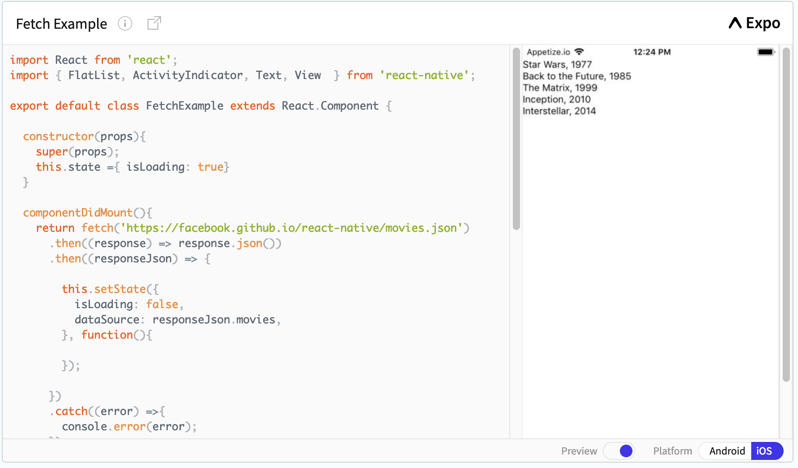
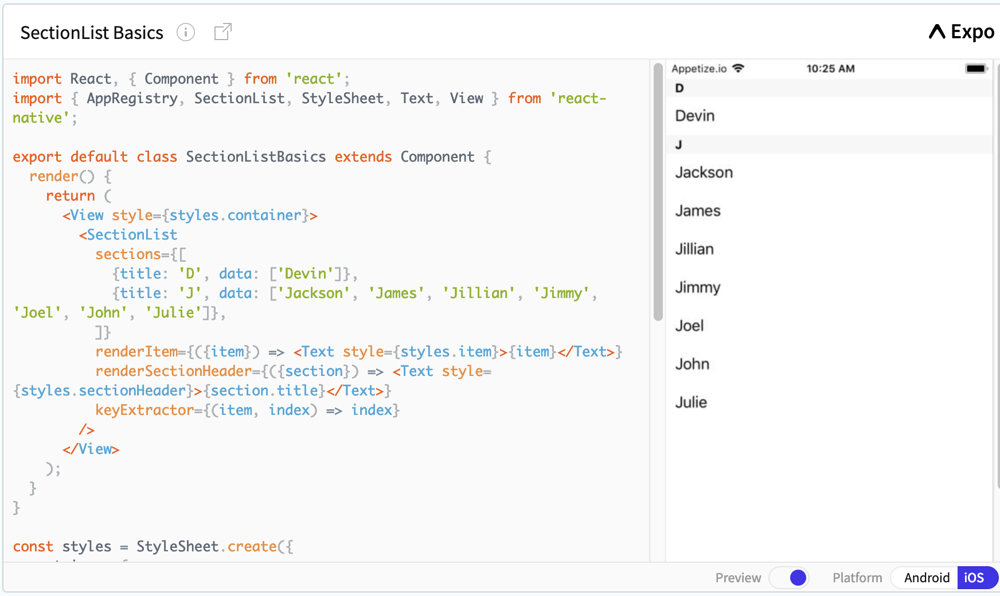

# Teach Your Self - React Native

## Using Fetch

## Creating Section List

### Why did you choose this subject?

* I've chosen to teach myself React Native. It is a term I have heard tossed around while researching React materials and guides during the Unit 3. I've decided to learn more about React, perhaps aspect of React.

### What is the history of this technology?

  * It all started with Facebook’s internal hackathon project. The core of React Native is worked on full-time by   Facebook's React Native team. If the issue is code related, you should consider checking the open issues in the main repository.

### What problem does it solve?

  * React Native was an obvious choice for multiple reasons. It solved our current architectural problems while allowing us to achieve a level of performance that is indistinguishable from native apps built with Java or Objective-C. 

  * Another reason is that React Native is a cross-platform solution: we’re planning to open our platform to other developers in order to supercharge development and build beautiful native apps for iOS and Android. 
  
  * Furthermore, React Native is super web developer friendly and doesn’t require learning native iOS and Android languages, or native APIs –learn once, write anywhere.

### Why does one use it?

  From my reading, using React Native enable the creater to build iOS and Android application as is.

  * What is it similar to, if anything?

  React Native is like React, but it uses native components instead of web components as building blocks. 
  
  So to understand the basic structure of a React Native app, you need to understand some of the basic React concepts, like JSX,components, state, and props. 

### What resources do you recommend for interested students?

  * Academind - React Native Tutorial for Beginners - Getting Started
  https://www.youtube.com/watch?v=6ZnfsJ6mM5c&t=790s

  * React Native Github - Original Source of Information
  http://facebook.github.io/react-native/docs/getting-started

### What are 3 interview questions one might be asked about this technology?

  * Explain React Native?
    * React Native is mobile app development platform that allow you to create android and ios apps only using Javascript. React Native uses the same fundamental UI building blocks as regular iOS and Android apps so applications created using React Native are indistinguishable from an app built using Objective-C or Java.

  * What is the relationship between React Native and React?
    * React Native is built using React. React, at its core, is a library for “diffing” a virtual DOM and rendering this DOM to a screen with minimal operations. React, by default, does not have an opinion about which nodes are in its virtual DOM tree. Instead, it simply has algorithms that can determine changes in the tree and re-render. React on the web provides its own node primitives (div, span, etc), which are the building blocks for web applications. But new node primitives can be defined, as React Native has done.

    * React Native defines its own primitives (<View>, <Image>, etc) which do not render HTML elements but instead map to native views, like UIView and UIImageView. It implements a bridge that allows the JavaScript runtime to communicate asynchronously with the native runtime. React itself provides the tree diffing and rendering infrastructure that allows React Native to work.

  * List some core components of React Native?
    * Text, Image, View, TextInput, ListView are some core components of React Native.